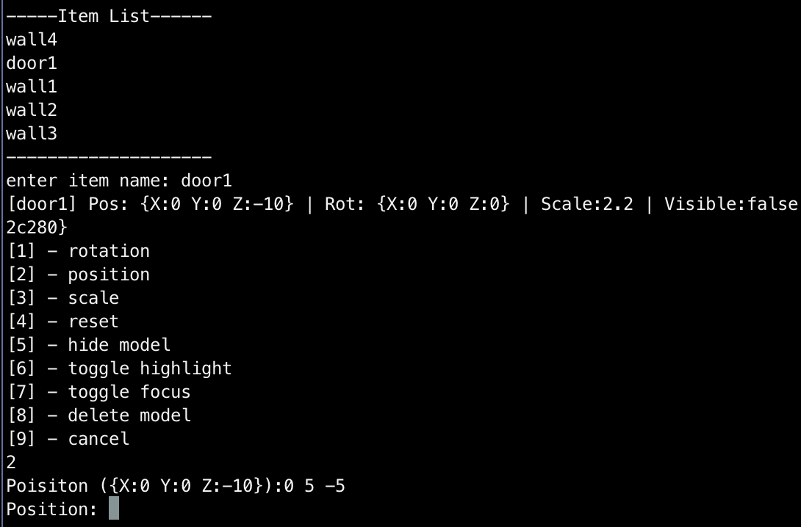
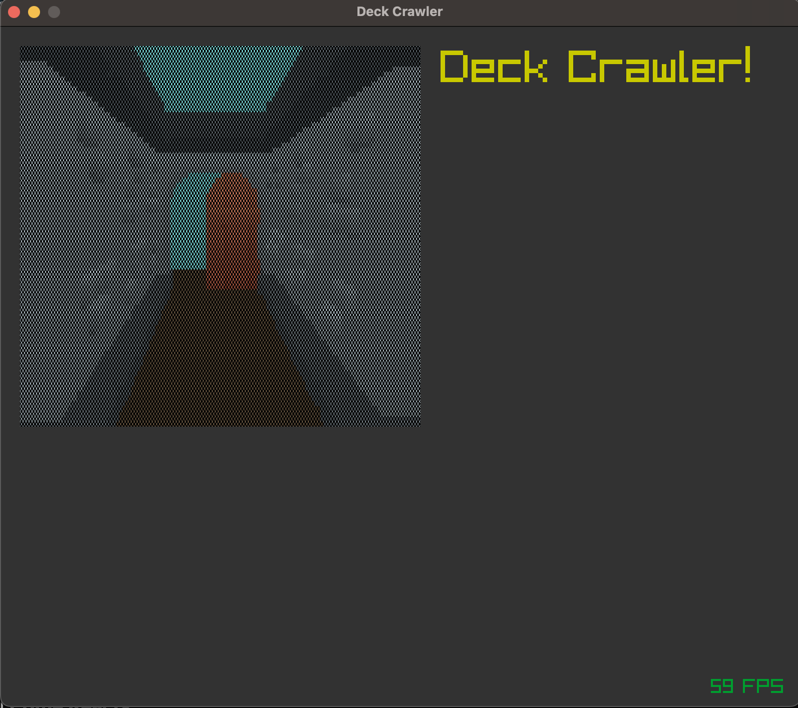

## Deck Crawler

**Deck Crawler** is a unique blend of deck-building and first-person dungeon crawling. Navigate procedurally generated dungeons using a strategic deck of cards to combat enemies, gather loot, and overcome challenges.

🚧 there is noting here yet 🚧

TCP editor server:

- Select an item from the scene
- Edit position, rotation, scale, hide/show, delete, highlight, focus, etc

To start the dev editor server use `--server` flag as:

```bash
go run . --server
```

You any tcp client to interact with the scene, ie:
On a different terminal:

1- Using `telnet`: <br>
<small>
_telnet: a client/server application protocol that provides access to virtual terminals of remote systems on local area networks or the Internet_
</small>

```bash
telnet 127.0.0.1 3000
```

2- Using `nc`: <br>
<small>_nc: networking utility for reading from and writing to network connections using TCP or UDP_</small>

```bash
nc 127.0.0.1 3000
```

<div align="left">
    
</div>

---

### Game Design

Starting this hobby project to add slowly the game design elements mentioned below, near the each feature you can see their progress as:<br>

- 🟢 : usable
- 🟡 : in progress
- 🔴 : not started

<div align="left">
  <a href="https://github.com/kaandesu/deck-crawler">
    
  </a>
  [WIP]
</div>
<br>
---

#### Deck Building 🔴

- **Starter Decks:** Begin with a basic deck featuring actions like attacks, defenses, spells, and utilities.
- **Card Acquisition:** Acquire new cards from chests, shops, and defeated enemies as you progress.
- **Deck Customization:** Modify your deck between dungeon runs by adding new cards, removing unwanted ones, and upgrading existing cards.

#### Dungeon Exploration 🔴

- **First-Person Perspective:** Explore dungeons from a first-person view with simple navigation controls (move forward, turn left/right, backtrack).
- **Procedurally Generated Levels:** Each dungeon is randomly generated, ensuring a unique experience with every run.
- **Rooms and Encounters:** Encounter enemies, traps, treasures, or events in each room of the dungeon.

#### Combat System 🔴

- **Turn-Based Combat:** Engage in turn-based combat where you draw cards from your deck to perform actions.
- **Energy System:** Manage a limited amount of energy each turn to play cards.
- **Status Effects:** Apply various status effects such as poison, burn, and freeze for strategic depth.

#### Progression and Difficulty 🔴

- **Dungeon Levels:** Navigate through multiple levels of dungeons with increasing difficulty.
- **Boss Fights:** Face powerful bosses at the end of each dungeon, requiring strategic use of your deck to defeat.
- **Meta-Progression:** Earn currency and experience to unlock new cards, abilities, and characters for future runs.

#### UI Design 🔴

- **Simple 3D Visualization:** Minimalistic 3D dungeon environment with a focus on clear UI elements.
- **Card Interface:** Card interface visible at the bottom of the screen showing hand, deck, and discard pile.
- **Dungeon Map:** Mini-map for an overview of the dungeon layout, showing the player’s location and unexplored areas.

### Art Style and Audio

- **Art Style:** Retro and modern blend with pixel art for cards and simple 3D models for the dungeon.
- **Audio:** Ambient dungeon sounds with distinct audio cues for events and a dynamic soundtrack that intensifies during combat.

### Contributing

All contributions are welcome! You can start by creating an issue.

### License

**Deck Crawler** is licensed under the [GNU General Public License v3.0](LICENSE.md).

### Contact

For questions or feedback, reach out with an issue or a discussion!

---

Inspired by [Double Dungeons](https://en.wikipedia.org/wiki/Double_Dungeons)... ❤️
